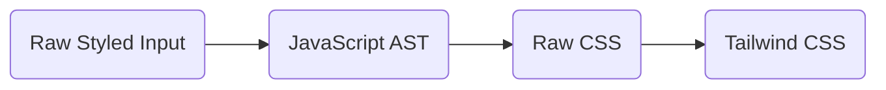

# Styled 2 Tailwind 🦄

## Flow chart



## Roadmap/milestone

- [ ] Setup boilerplate project
- [ ] Setup Github Actions with simple test runner
- [ ] ...

## Supported declaration variants

```tsx
// Standard declaration
const Button = styled.button`
    background: white;
    color: palevioletred;
    font-size: 1em;
    padding: 0.25em 1em;
    border: 2px solid palevioletred;
    border-radius: 3px;
`;
​
// Declaration based on other Component
const TomatoButton = styled(Button)`
    color: tomato;
    border-color: tomato;
`;
​
// Declaration with css function
const buttonStyles = css`
    background: white;
    color: palevioletred;
    font-size: 1em;
    padding: 0.25em 1em;
    border: 2px solid palevioletred;
    border-radius: 3px;
`;
​
// Keyframes 
const fadeIn = keyframes`
    0% { opacity: 0; }
    100% { opacity: 1; }
`;

// With Attrs and Interpolated Props
const Input = styled.input.attrs(props => ({
    type: "text",
    size: props.small ? 5 : undefined,
}))`
    color: palevioletred;
    font-size: 1em;
    border: 2px solid palevioletred;
    border-radius: 3px;
​
    margin: ${props => props.size};
    padding: ${props => props.size};
`;
```

<details>
  <summary>Variants we should support after the MVP</summary>
  
  ```tsx

  // TBD
  const Button = styled.button({
      background: 'white',
      color: 'palevioletred',
      fontSize: '1em',
      padding: '0.25em 1em',
      border: '2px solid palevioletred',
      borderRadius: '3px',
  });
  
  // TBD
  render() {
      const Button = styled.button`
          color: palevioletred;
      `;
  ​
      return <Button>Click me!</Button>;
  }
  
  // TBD
  const Button = styled.button`
      ${buttonStyles}
  `;
  ```
</details>
