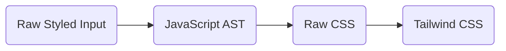

<div align="center">
  <h1>Styled2Tailwind 🌀</h1>
  <p>Transform your Styled-Components into TailwindCSS with this handy codemod.</p> 

  <br />
  
  

</div>

<div align="center">
  <a href="https://www.npmjs.com/package/styled2tailwind"></a>  
  
  
  
</div>

## 🌟 Motivation

With Next.js introducing the new App Directory routing, it also introduced support for Server and Client components. Styled-components don't gel well with server components due to their heavy reliance on the JS runtime. Tailwind, on the other hand, slides right in and performs beautifully! 

We also love Tailwind and we believe it enhances the development process, making it faster with a superior developer experience. 

## 🚀 Getting Started
1. Begin by giving the repository a star! ⭐
2. Type the following command to dive into the CLI world:
   
```sh
$ npx styled2tailwind --help
```

## 🤔 How It Works

Our mechanism runs in four distinct steps:

1. **Raw Input**: We start by taking the RAW React Component as input (make sure it includes some styled components). 
2. **JavaScript AST**: Convert the component to JavaScript AST using Babel. 
3. **From AST to CSS**: Extract all TemplateLiterals data from the AST and morph it into CSS. 
4. **Tailwind Conversion**: The final leg involves converting this CSS into TailwindCSS format.



## 📋 Commands Overview
| Command | Description |
|---------|-------------|
| `styled2tailwind --help` | Displays help command. |
| `styled2tailwind "src/*.jsx"` | Parses all .jsx files inside src directory (supports regex). |
| `styled2tailwind "src/*.jsx" --no-replace` | Instead of replacing styled components with tailwind, it appends the tailwind output at the end of the file. |
| `styled2tailwind "src/*.jsx" --no-conflicts` | Forcefully replaces styled components with tailwind in the markup without using git conflicts. |

## ⚠️ Limitations

This project is still in early beta, we already tracked some limitations and we will ship fix for those in very near future!

- **Multi-Line Components**: CLI can act mysteriously while one component is wrapped into multiple lines.
- **Dynamic React Props**: Handling dynamic React props (especially functions) still poses a challenge.

## 🤝 Contribution

Contributions are always welcome! To contribute, please follow these steps:

1. Fork the repository.
2. Create a new branch with a descriptive name.
3. Make your changes, and commit them using the [Conventional Commits](https://www.conventionalcommits.org/) format.
4. Push your changes to the forked repository.
5. Create a pull request, and we'll review your changes.

## 📡 Community

If you're looking for help or simply want to share your thoughts about the project, we encourage you to join our Discord community. Here's the link: [https://blazity.com/discord](https://blazity.com/discord). It's a space where we exchange ideas and help one another. Everyone's input is appreciated, and we look forward to welcoming you.

## 📜 License

This project is licensed under the MIT License. For more information, see the [LICENSE](./LICENSE) file.


